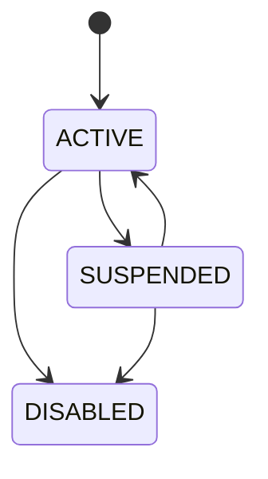
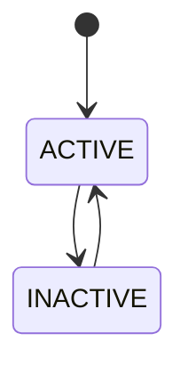
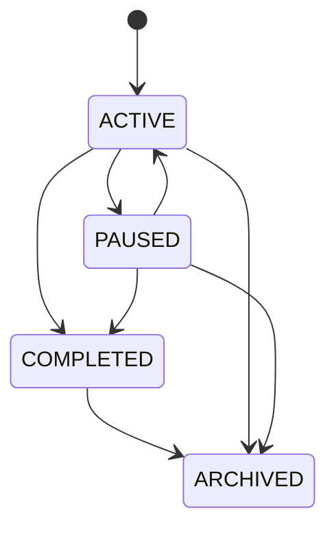
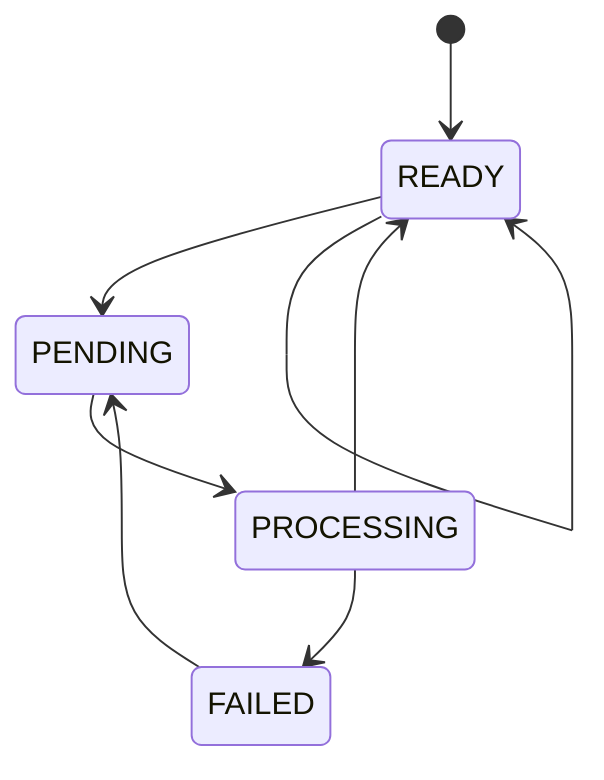
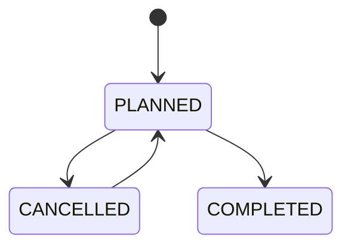
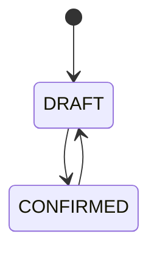
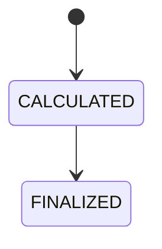

# ドメイン・業務ロジック設計書

## 1. 文書概要

### 1.1 目的

本書は、Flowance のドメインモデル、集約境界、業務ルール、状態遷移、計算ロジック、整合性制約を定義する。

要件定義書、基本設計書、バックエンドクリーンアーキテクチャ設計書、DB設計書、API設計をもとに、実装時に Domain 層および Application 層へ配置すべき判断基準を明確にする。

### 1.2 対象範囲

フェーズ1では次を対象とする。

- 認証・組織・メンバー
- クライアント管理
- 案件管理
- アイコン管理
- 契約管理
- 週次予定・個別作業予定
- 稼働実績
- 月次精算
- 監査ログ
- 冪等性制御
- 非同期タスク管理

請求書、入金、分析はドメイン上の将来拡張ポイントとして定義するが、アプリケーション機能としてはフェーズ2対応とする。

### 1.3 レイヤー方針

業務ルールは原則として Django アプリケーション内の Domain 相当層または Application 相当層へ置く。

| レイヤー | 責務 |
| --- | --- |
| Domain | Entity、Value Object、Domain Service、状態遷移、計算、業務例外 |
| Application | Use Case、トランザクション境界、Repository Port、外部Port呼び出し |
| Infrastructure | JPA、PostgreSQL、Redis、Storage、Background Worker、外部技術連携 |
| Presentation | HTTP入力検証、DTO変換、Use Case呼び出し、レスポンス変換 |

Presentation 層、Serializer、Controller に複雑な業務ルールを実装してはならない。

## 2. ドメイン全体像

### 2.1 サブドメイン

| サブドメイン | 主な責務 | フェーズ |
| --- | --- | --- |
| Accounts | 利用者、認証、Token、ログアウト | Phase1 |
| Organizations | 組織、メンバー、ロール、テナント境界 | Phase1 |
| Clients | クライアント情報、クライアントアイコン、取引状態 | Phase1 |
| Projects | 案件、案件状態、案件アイコン、クライアント関連 | Phase1 |
| Contracts | 契約履歴、契約種別、単価、精算条件 | Phase1 |
| Scheduling | 週次予定、個別予定、カレンダーイベント | Phase1 |
| Work Records | 稼働実績、休憩、請求対象時間 | Phase1 |
| Settlements | 月次精算、再計算、確定 | Phase1 |
| Invoices | 請求書、請求明細、PDF | Phase2 |
| Payments | 入金、手数料、過不足金 | Phase2 |
| Analytics | 売上、稼働、顧客集中度の集計 | Phase2 |
| Shared | ファイル、監査、冪等性、Outbox、非同期タスク | Phase1 |

### 2.2 テナント境界

Flowance は組織をテナント境界とする。

以下の業務データは必ず `organization_id` を持つ。

- clients
- projects
- project_members
- project_contracts
- project_weekly_schedules
- work_schedules
- work_records
- monthly_project_settlements
- invoices
- payments
- stored_files
- audit_logs
- idempotency_keys
- background_tasks

Application 層は、参照・更新対象がログイン利用者の所属組織に属することを必ず検証する。

## 3. 集約設計

### 3.1 User 集約

| 項目 | 内容 |
| --- | --- |
| 集約ルート | User |
| 主な値 | email、password、displayName、timezone、status |
| 不変条件 | email は小文字正規化し一意、平文パスワードを保存しない |
| 主な操作 | 登録、ログイン、ログアウト、Token無効化 |

User は複数 Organization に所属できる。ただし、本サービスの初期登録時は User、Organization、OWNER メンバーを同一トランザクションで作成する。

### 3.2 Organization 集約

| 項目 | 内容 |
| --- | --- |
| 集約ルート | Organization |
| 関連Entity | OrganizationMember |
| 不変条件 | 組織には最低1人の OWNER が必要 |
| 主な操作 | メンバー招待、ロール変更、停止 |

最後の OWNER を削除または降格してはならない。

### 3.3 Client 集約

| 項目 | 内容 |
| --- | --- |
| 集約ルート | Client |
| 関連 | StoredFile |
| 不変条件 | name は空不可、icon_type と icon_file_id の整合性を保つ |
| 主な操作 | 登録、更新、無効化、アイコン登録、アイコン削除 |

Client は Projects の内部実装へ依存しない。案件数、累計売上、未入金額などは Query 側で集計する。

### 3.4 Project 集約

| 項目 | 内容 |
| --- | --- |
| 集約ルート | Project |
| 関連 | Client、ProjectMember、StoredFile |
| 不変条件 | client は同一組織、start_date は end_date 以前、workload_rate は 0〜100 |
| 主な操作 | 登録、更新、状態変更、アイコン登録、アイコン削除 |

案件の開始日・終了日は、契約期間ではなく案件管理上の期間として保持する。

### 3.5 Contract 集約

| 項目 | 内容 |
| --- | --- |
| 集約ルート | ProjectContract |
| 所属 | Project |
| 不変条件 | 契約種別ごとの必須項目、金額非負、税率0〜100、期間整合 |
| 主な操作 | 契約登録、契約更新、契約削除 |

契約は案件の精算条件を表す。案件そのものの開始日・終了日とは役割が異なる。

### 3.6 Schedule 集約

| 集約 | 内容 |
| --- | --- |
| ProjectWeeklySchedule | 曜日単位の定期予定 |
| WorkSchedule | 実日付に展開された個別作業予定 |

週次予定は生成元であり、カレンダー表示の最小単位は WorkSchedule または WorkRecord とする。

### 3.7 WorkRecord 集約

| 項目 | 内容 |
| --- | --- |
| 集約ルート | WorkRecord |
| 関連Entity | WorkBreak |
| 不変条件 | actual_start_at は actual_end_at より前、休憩は実績時間内、休憩同士は重複不可 |
| 主な操作 | 登録、更新、削除、確定 |

`actual_minutes`、`billable_minutes`、`break_minutes` はフロントエンドから受け取らず、バックエンドで計算する。

### 3.8 Settlement 集約

| 項目 | 内容 |
| --- | --- |
| 集約ルート | MonthlyProjectSettlement |
| 関連 | Project、ProjectContract、WorkRecord、WorkSchedule |
| 不変条件 | organization_id、project_id、settlement_month は一意、FINALIZED は finalized_at 必須 |
| 主な操作 | 計算、再計算、確定、未確定削除 |

確定済み精算は、再計算・削除できない。

### 3.9 Invoice / Payment 集約

請求書・入金はフェーズ2対応とする。

ただし、DB設計上は次のドメイン境界を保持する。

- Invoice は請求書ヘッダと請求明細を持つ
- InvoiceItem は Settlement を参照できる
- Payment は Invoice へ紐づく
- 入金額により balance_amount / overpaid_amount を算出する

## 4. Value Object

| Value Object | 内容 | 主な制約 |
| --- | --- | --- |
| EmailAddress | メールアドレス | 小文字正規化、形式検証 |
| Money | 金額 | decimal.Decimal、通貨、原則0以上 |
| TaxRate | 税率 | 0〜100 |
| TimeRange | 日時範囲 | start < end |
| DateRange | 日付範囲 | from <= until |
| Month | 精算月 | 月初日として保持、APIではYYYY-MM |
| ColorCode | 色 | `#RRGGBB` |
| IconText | UUIDベースの動物絵文字 | 定義済み16種のいずれか |
| WorkMinutes | 分数 | 0以上 |
| Version | 楽観ロック値 | 1以上 |

金額計算に浮動小数点を使用してはならない。

## 5. 状態遷移

### 5.1 UserStatus



### 5.2 ClientStatus



INACTIVE のクライアントは新規案件作成の候補から除外してよい。ただし既存案件・履歴は保持する。

### 5.3 ProjectStatus



ARCHIVED は通常の一覧から除外してよいが、履歴参照は可能とする。

### 5.4 IconStatus



アップロード直後は PENDING とし、Background Worker が PROCESSING、READY、FAILED へ遷移させる。

### 5.5 WorkScheduleStatus



WorkRecord によって実績化された予定は COMPLETED にできる。

### 5.6 WorkRecordStatus



ただし、確定済み精算に含まれる WorkRecord は更新・削除・DRAFT戻し不可とする。

### 5.7 SettlementStatus



FINALIZED は終端状態とする。

## 6. 業務ロジック詳細

### 6.1 認証・登録

利用者登録では次を同一トランザクションで実行する。

1. email 重複確認
2. パスワード強度検証
3. User 作成
4. Organization 作成
5. OWNER メンバー作成
6. JWT 発行
7. Cookie 設定

パスワード平文は保存しない。

### 6.2 認可

ロールは次を基本とする。

| ロール | 概要 |
| --- | --- |
| OWNER | 組織管理、全機能操作 |
| ADMIN | 業務データ管理 |
| MEMBER | 割当案件の参照・予定・実績操作 |
| ACCOUNTANT | 精算・請求・入金系の操作 |

MEMBER の案件アクセスは ProjectMember で制御する。

Phase1ではクライアント・案件・契約の閲覧と、自身の予定・稼働実績の操作を許可する。マスタ、契約、精算の変更は OWNER / ADMIN のみに許可し、案件単位の細粒度権限は Phase3 で扱う。

### 6.3 初期アイコン生成

Client / Project のアイコン画像が指定されない場合、初期アイコンを自動生成する。

生成ルール：

- UUID の SHA-256 ハッシュから決定的に生成する
- ハッシュの第1バイトを固定16種の動物絵文字へ割り当てる
- ハッシュの第2バイトを水色系を除く固定淡色8色へ割り当てる
- 互換用文字色は `#294B5B` とする
- 名称変更では動物、背景色、互換用文字色を変更しない
- UPLOADED の場合も同じ値をフォールバックとして保持する
- 同じ UUID では常に同じ組み合わせを返す

アイコン削除時は `icon_type=DEFAULT`、`icon_file_id=null` に戻す。

### 6.4 ファイル・画像処理

画像アップロードでは同期処理と非同期処理を分ける。

同期処理：

- ファイルサイズ検証
- MIME Type 検証
- 拡張子検証
- StoredFile 作成
- 対象Entityの icon_status を PENDING に変更
- Background Task 登録

非同期処理：

- EXIF Orientation 反映
- メタデータ削除
- 中央トリミング
- WebP 変換
- 64 / 128 / 256 px の派生ファイル生成
- StoredFileVariant 作成
- 対象Entityの icon_status を READY または FAILED に変更

SVG は受け付けない。

### 6.5 契約検証

共通ルール：

- 金額は0以上
- 税率、源泉徴収税率は0以上100以下
- `valid_from <= valid_until`
- `rounding_unit_minutes` は 1、5、10、15、30、60 のいずれか
- `closing_day` は 1〜31 または月末指定

契約種別ごとのルール：

| 契約種別 | 必須項目 | 計算概要 |
| --- | --- | --- |
| HOURLY | hourly_rate | 請求対象分数 × 時間単価 |
| MONTHLY_RANGE | monthly_rate、minimum_minutes、maximum_minutes、base_minutes、deduction_rate、overtime_rate | 基準範囲内は月額、下限未満は控除、上限超過は超過加算 |
| MONTHLY_FIXED | monthly_rate | 月額固定 |
| PERFORMANCE | performance_amount | 成果報酬額 |

同一案件内の未削除契約は有効期間の重複を禁止する。Application層で事前検証し、PostgreSQLのbtree_gistとdaterange(valid_from, valid_until + 1日, '[)') exclusion constraintでも保証する。別案件の同期間契約は許可する。
契約の登録・更新・削除はOWNER/ADMIN、閲覧はMEMBER以上に許可する。削除は論理削除とし、未確定精算で参照中の場合はCONTRACT_IN_USEで拒否する。確定済み精算はsnapshotと参照を保持するため削除可能とする。
現在契約は組織タイムゾーンの当日にACTIVEかつ有効期間内であるかを判定する。

### 6.6 週次予定生成

週次予定から個別作業予定を生成する。

生成条件：

- `is_active=true`
- 対象日が `valid_from` 以降
- `valid_until` がある場合、対象日が `valid_until` 以前
- weekday が対象日の曜日と一致

重複防止：

- `recurrence_source_id` と `generation_date` の組み合わせを一意とする
- 既に手動変更済みの個別予定は自動生成で上書きしない

### 6.7 個別作業予定

予定の制約：

- `scheduled_start_at < scheduled_end_at`
- `planned_break_minutes` は予定時間以下
- 週次予定から生成された予定を手動変更した場合、`is_manually_overridden=true` とする

カレンダー表示 API は予定・実績イベントの識別子、projectId、userId、時間、状態のみを返す。案件名、案件アイコン、ユーザー表示名は別 API の結果をフロントエンドで結合する。

### 6.8 稼働実績計算

フロントエンドは次を送信する。

- projectId
- userId またはログイン利用者
- workScheduleId 任意
- actualStartAt
- actualEndAt
- breaks
- isBillable
- status
- notes

バックエンドは次を計算する。

```text
grossMinutes = actualEndAt - actualStartAt
breakMinutes = sum(eachBreak.endAt - eachBreak.startAt)
actualMinutes = grossMinutes - breakMinutes
billableMinutes = isBillable ? applyRounding(actualMinutes, contract.roundingRule) : 0
```

制約：

- `actualStartAt < actualEndAt`
- 休憩は実績時間内に収まる
- 休憩同士は重複しない
- `actualMinutes >= 0`
- `billableMinutes >= 0`
- 確定済み精算に含まれる実績は更新・削除不可

### 6.9 時間丸め

丸め方式：

| 方式 | 内容 |
| --- | --- |
| ROUND_DOWN | 指定単位へ切り捨て |
| ROUND_UP | 指定単位へ切り上げ |
| ROUND_HALF_UP | 指定単位で四捨五入 |

丸めは契約の `rounding_unit_minutes` を使用する。

### 6.10 月次精算

精算計算は Project、対象月、計算基準を入力として行う。

入力：

- projectId
- settlementMonth
- calculationBasis

計算基準：

| basis | 内容 |
| --- | --- |
| ACTUAL | 稼働実績を基準にする |
| SCHEDULED | 作業予定を基準にする |

共通計算：

```text
scheduledMinutes = 対象月の予定分数合計
actualMinutes = 対象月の実績分数合計
billableMinutes = 対象月の請求対象分数合計
```

HOURLY：

```text
baseAmount = billableMinutes / 60 * hourlyRate
deductionAmount = 0
overtimeAmount = 0
```

MONTHLY_RANGE：

```text
if billableMinutes < minimumMinutes:
    baseAmount = monthlyRate
    deductionAmount = (baseMinutes - billableMinutes) / 60 * deductionRate
    overtimeAmount = 0
elif billableMinutes > maximumMinutes:
    baseAmount = monthlyRate
    deductionAmount = 0
    overtimeAmount = (billableMinutes - baseMinutes) / 60 * overtimeRate
else:
    baseAmount = monthlyRate
    deductionAmount = 0
    overtimeAmount = 0
```

税・源泉徴収：

```text
taxableAmount = baseAmount - deductionAmount + overtimeAmount
taxAmount = taxableAmount * taxRate
withholdingAmount = taxableAmount * withholdingTaxRate
totalAmount = taxableAmount + taxAmount - withholdingAmount
```

端数処理は税・源泉徴収・金額計算ルールとして Domain Service に集約する。

### 6.11 精算確定

精算確定時のルール：

- status が CALCULATED の精算のみ確定できる
- version が一致すること
- Idempotency-Key を必須とする
- 確定時に finalized_at、finalized_by を設定する
- 確定後は再計算・削除不可

未確定精算のみ削除できる。

### 6.12 請求・入金

フェーズ2対応とする。

将来ルール：

- 請求書は DRAFT から ISSUED へ発行する
- 発行時に invoice_number を採番する
- PDF は非同期生成する
- 入金登録時に paid_amount、balance_amount、overpaid_amount を再計算する
- 発行済み請求書や入金済み請求書の破壊的変更は禁止する

## 7. 整合性・排他制御

### 7.1 楽観ロック

更新系 API は `version` を受け取り、現在値と一致する場合のみ更新する。

成功時は `version + 1` とする。

不一致の場合は 409 Conflict を返す。

### 7.2 冪等性

次の処理は Idempotency-Key を必須とする。

- 精算確定
- 請求書発行
- 将来の決済・外部連携系処理

同じ organization_id、endpoint、Idempotency-Key の組み合わせでは同じ結果を返す。

### 7.3 論理削除

履歴性が必要なデータは物理削除しない。

- 確定済み精算
- 請求書
- 入金
- 監査ログ

クライアント、案件、予定、実績は業務影響に応じて論理削除を基本とする。

### 7.4 監査ログ

重要操作では AuditLog を記録する。

- 認証・ログアウト
- ロール変更
- クライアント更新
- 案件更新
- 契約更新
- 実績更新
- 精算確定
- 請求書発行
- 入金登録

監査ログは業務履歴として削除しない。

## 8. Domain Service

| Service | 責務 |
| --- | --- |
| IconGenerationService | UUIDベースの動物絵文字・背景色・互換用文字色の生成 |
| ContractValidationService | 契約種別ごとの必須項目・期間・単価検証 |
| WorkTimeCalculationService | 実績時間、休憩時間、請求対象時間の計算 |
| TimeRoundingService | 契約条件に基づく時間丸め |
| SettlementCalculationService | 月次精算金額の計算 |
| TaxCalculationService | 消費税・源泉徴収・端数処理 |
| PermissionPolicy | ロール・ProjectMember による操作可否判定 |
| StateTransitionPolicy | 状態遷移の妥当性判定 |

## 9. Application Use Case

| Use Case | 主な処理 |
| --- | --- |
| RegisterUser | User、Organization、OWNER Member 作成、Token発行 |
| LoginUser | 認証、Token発行、Cookie設定 |
| LogoutUser | Refresh Token Blacklist、Cookie削除 |
| CreateClient | Client作成、初期アイコン生成 |
| UpdateClient | 楽観ロック、Client更新 |
| UploadClientIcon | ファイル受付、StoredFile作成、Task登録 |
| DeleteClientIcon | アイコンをDEFAULTへ戻す |
| CreateProject | Project作成、初期アイコン生成 |
| UpdateProject | 案件情報・状態更新 |
| RegisterContract | 契約検証、契約作成 |
| BulkCreateWeeklySchedules | 週次予定一括登録 |
| GenerateWorkSchedules | 週次予定から個別予定生成 |
| CreateWorkSchedule | 個別予定作成 |
| UpdateWorkSchedule | 個別予定更新、手動変更フラグ設定 |
| RegisterWorkRecord | 実績登録、分数計算 |
| UpdateWorkRecord | 実績更新、休憩置換、分数再計算 |
| CalculateSettlement | 契約・予定・実績から月次精算計算 |
| RecalculateSettlement | 未確定精算を再計算 |
| FinalizeSettlement | 精算確定、冪等性制御 |
| DeleteUnfinalizedSettlement | 未確定精算削除 |

## 10. 実装時の注意点

- Domain 層は Django、Django ORM、HTTP、Redis、Storage に依存しない。
- 金額は Python の decimal.Decimal と Django DecimalField を使用し、浮動小数点を使用しない。
- 日時は UTC で保存し、表示時に利用者 timezone へ変換する。
- API の DELETE では requestBody を使用せず、version は query parameter で受け取る。
- 計算結果はフロントエンドから受け取らず、バックエンドで再現可能にする。
- 確定済みデータは原則として破壊的変更を禁止する。
- 非同期処理は BackgroundTask と状態をDBで追跡する。
- Phase2 の請求・入金・分析に依存する画面やメニューは TODO として明示し、Phase1 実装範囲から外す。

## 11. Phase1 対応結果と将来検討

| 項目 | Phase1採用方針 |
| --- | --- |
| 契約期間重複 | 同一案件内は禁止、別案件間は許可。Application検証とPostgreSQL exclusion constraintで担保 |
| 金額端数処理 | 消費税と源泉徴収は税率単位で1回だけROUND_DOWN。丸め済み金額から合計を算出 |
| 月額精算の控除計算 | baseMinutesとの差分を控除・超過計算に使用 |
| MEMBER権限 | 閲覧と自身の予定・実績操作を許可。マスタ・契約・精算変更はOWNER / ADMINのみ |
| 案件単位の細粒度権限 | Phase3で扱う |
| 請求・入金 | Phase2でAPI・画面・状態遷移を確定する |
