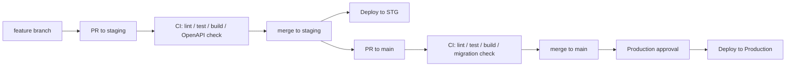

# インフラ・運用設計書

## 1. 文書概要

### 1.1 目的

本書は、Flowance Phase1 におけるインフラ構成、環境構成、デプロイ、監視、バックアップ、障害対応、運用手順の基本方針を定義する。

Flowance は Phase1 では、Next.js、Django REST Framework、PostgreSQL、Redis、Celery、Cloudflare R2 を中心とした構成で構築する。業務上の正規データは PostgreSQL に保持し、Redis、Celery Result、ファイル名、ブラウザ状態を正規データとして扱わない。

### 1.2 対象範囲

Phase1 の対象範囲は以下とする。

- ローカル開発環境
- 本番環境を見据えた構成方針
- Next.js フロントエンド運用
- Django / DRF バックエンド運用
- PostgreSQL 運用
- Redis 運用
- Celery Worker 運用
- Cloudflare R2 / Cloudflare CDN / ローカルファイルストレージ運用
- Django Migration 運用
- 環境変数・Secret 管理
- ログ、監視、可観測性
- バックアップ、リストア方針
- 障害対応方針
- リリース、ロールバック方針

### 1.3 Phase1 対象外

以下は Phase2 以降または本番運用前に詳細化する。

- 請求書 PDF 生成基盤
- 入金連携基盤
- 分析、収支、BI 向け集計基盤
- ACCOUNTANT ロール向け運用
- 外部会計サービス連携
- 外部カレンダー同期
- 通知基盤
- Kubernetes 本格運用
- マルチリージョン構成
- 高度なオートスケーリング
- 高度な CDN チューニング
- WAF 詳細設計
- SIEM 連携
- 本格的な DR 環境

## 2. 参照設計

本書は以下の設計書と整合させる。

- 要件定義書
- 基本設計書
- システムアーキテクチャ設計書
- バックエンド Clean Architecture 設計書
- フロントエンドアーキテクチャ設計書
- DB 設計書
- API 設計書
- 認証・認可設計書
- エラーハンドリング設計書
- 非同期処理設計書
- ファイル・画像管理設計書
- キャッシュ設計書

## 3. 基本方針

### 3.1 インフラ設計の原則

Flowance Phase1 のインフラは以下を原則とする。

1. 小さく始められる構成にする。
2. 本番移行時に構成を大きく作り直さなくてよい形にする。
3. 正規データは PostgreSQL に集約する。
4. Redis は Celery Broker、短時間キャッシュ、レート制限、一時状態に限定する。
5. ファイルのバイナリは PostgreSQL へ保存しない。
6. 本番ファイルストレージは Cloudflare R2 を採用する。
7. 本番画像配信は Cloudflare R2 にカスタムドメインを接続し、Cloudflare CDN を併用する。
8. Secret は環境変数または Secret Manager で管理する。
9. PostgreSQL、Redis は外部へ直接公開しない。
10. 本番環境では HTTPS を前提とする。
11. ログ、Trace ID、監査ログから障害箇所を追跡できるようにする。
12. Django Migration を DB スキーマ変更の正とする。
13. OpenAPI を API 仕様の正とする。

### 3.2 Phase1 の構成単位

| 構成要素 | 技術 | 主な責務 |
| --- | --- | --- |
| Web フロントエンド | Next.js / React / TypeScript | 画面表示、ルーティング、フォーム、API 通信 |
| バックエンド API | Python / Django / DRF | 認証、認可、業務処理、API 提供 |
| DB | PostgreSQL | 業務データ、認証データ、監査ログ、冪等性、Outbox |
| Broker / 一時データ | Redis | Celery Broker、短時間キャッシュ、レート制限、一時状態 |
| 非同期処理 | Celery Worker | 画像変換、旧画像削除、孤立ファイル削除、Outbox 処理 |
| ファイルストレージ | Django Storage API / Cloudflare R2 | アイコン元画像、表示用画像、一時生成ファイル |
| CDN | Cloudflare CDN / Custom Domain | 表示用画像の配信高速化、キャッシュ、アクセス制御補助 |
| ローカルファイル | Django MEDIA_ROOT / Volume | 開発環境でのファイル保存 |

### 3.3 正規データの扱い

正規データは PostgreSQL に保存する。

以下は正規データとして扱わない。

- Redis 上の値
- Celery Result
- ブラウザの localStorage / sessionStorage
- Next.js のクライアント状態
- ファイル名だけの情報
- 署名付き URL
- 一時ディレクトリ内のファイル

## 4. 環境構成

### 4.1 ローカル開発環境

ローカル開発では、フロントエンドは Docker Compose では起動せず、ホスト環境で Next.js 開発サーバーとして起動する。

フロントエンド:

- flowance-web で Next.js を起動する
- 例: npm run dev
- Django API へ HTTP で接続する

Docker Compose で起動する対象:

- backend
- postgres
- redis
- celery-worker
- file-storage 用 Volume

必要に応じて追加する対象:

- Mailpit
- Flower
- Prometheus
- Grafana

### 4.2 開発・検証環境

開発・検証環境は、本番に近い構成を小さく再現する。

- Next.js は本番ビルドで動作確認する
- Django は DEBUG=False 相当で動作確認する
- PostgreSQL は本番と同じメジャーバージョンを使用する
- Redis は Celery Broker として利用する
- Cloudflare R2 は検証用 bucket または prefix を分ける
- Django Migration をデプロイ手順に含める

### 4.3 本番環境

本番環境では以下を前提とする。

- HTTPS を必須とする
- DEBUG=False とする
- ALLOWED_HOSTS を明示する
- CSRF_TRUSTED_ORIGINS を明示する
- CORS 許可 Origin を限定する
- JWT は HttpOnly Cookie に保存する
- Cookie には Secure、HttpOnly、SameSite を設定する
- PostgreSQL は外部公開しない
- Redis は外部公開しない
- Cloudflare R2 bucket は非公開を基本とする
- 表示用画像の本番配信は R2 custom domain + Cloudflare CDN を利用する
- r2.dev は開発・検証用途に限定し、本番配信では使用しない
- Secret は環境変数または Secret Manager で管理する

## 5. デプロイ設計

### 5.1 デプロイ単位

Phase1 のデプロイ単位は以下とする。

- Next.js
- Django API
- Celery Worker
- PostgreSQL
- Redis
- Cloudflare R2

Celery Beat は定期メンテナンスが必要になった段階で導入する。Phase1 で導入する場合も、必須の業務処理を Beat だけに依存させず、再実行可能な運用にする。

### 5.2 デプロイ順序

標準的なデプロイ順序は以下とする。

1. PostgreSQL、Redis、R2 の疎通確認
2. 必要に応じて DB バックアップを取得
3. Django Migration を実行
4. Django API をデプロイ
5. Celery Worker をデプロイ
6. Next.js をデプロイ
7. Smoke Test を実行
8. ログ、メトリクス、タスク滞留を確認

### 5.3 Migration 運用

DB スキーマ変更は Django Migration で管理する。

- Migration ファイルを Git 管理する
- 手動で本番スキーマを直接変更しない
- CI で Migration 差分を確認する
- 本番デプロイ時に Migration を実行する
- 後方互換性が必要な変更は段階的に反映する
- 大量データ更新を伴う Migration は事前に所要時間を確認する

### 5.4 ロールバック方針

ロールバックは以下の順で判断する。

1. アプリケーションのみの戻しで復旧できるか確認する
2. Migration が後方互換であれば前バージョンへ戻す
3. 破壊的 Migration を伴う場合は DB リストアの要否を判断する
4. 非同期タスクの重複実行、未完了タスク、失敗タスクを確認する
5. ファイル保存処理が絡む場合は R2 と DB の整合性を確認する

Phase1 では、破壊的 Migration を避け、後方互換な Migration を優先する。

## 6. 環境変数・Secret 管理

### 6.1 基本方針

Secret は Git にコミットしない。

環境ごとに以下を管理する。

| 種別 | 例 | 方針 |
| --- | --- | --- |
| Django Secret | SECRET_KEY | Secret Manager または環境変数で管理 |
| Django 設定 | DEBUG、ALLOWED_HOSTS | 環境ごとに明示 |
| Cookie 設定 | COOKIE_SECURE、SAMESITE | 本番は Secure を有効化 |
| CSRF / CORS | CSRF_TRUSTED_ORIGINS、CORS_ALLOWED_ORIGINS | 許可 Origin を限定 |
| DB 接続 | DATABASE_URL | Secret として管理 |
| Redis 接続 | REDIS_URL、CELERY_BROKER_URL | Secret として管理 |
| R2 接続 | R2_ENDPOINT、R2_BUCKET、R2_ACCESS_KEY_ID、R2_SECRET_ACCESS_KEY | Secret として管理 |
| JWT 設定 | JWT 署名鍵、Cookie 名 | Secret として管理 |
| 監視 | SENTRY_DSN など | 導入時に Secret として管理 |

### 6.2 Secret ローテーション

本番運用では以下のローテーションを想定する。

- R2 Access Key
- DB パスワード
- Redis パスワード
- JWT 署名鍵
- Django SECRET_KEY

JWT 署名鍵を変更する場合は、既存セッションへの影響を考慮し、段階的な切り替えまたは再ログイン方針を決める。

## 7. PostgreSQL 運用

### 7.1 役割

PostgreSQL は Flowance の正規データストアである。

保存対象:

- 利用者、組織、メンバー
- クライアント、案件、契約
- スケジュール、稼働実績、精算
- 監査ログ
- 冪等性キー
- 非同期タスク状態
- ファイルメタデータ
- Outbox

### 7.2 運用方針

- 定期バックアップを取得する
- 本番運用前に RPO / RTO を決定する
- リストア手順を検証する
- 監査ログを保持する
- slow query を確認できるようにする
- インデックス追加は実行計画を確認する
- 契約期間重複は Application 検証と PostgreSQL exclusion constraint の両方で防止する

### 7.3 バックアップ方針

Phase1 では PostgreSQL バックアップを最重要の運用対象とする。

- 本番 DB は自動バックアップを有効化する
- バックアップの保存期間を定める
- リストア手順を文書化する
- リストアテストを本番運用前に実施する
- バックアップの取得失敗を検知する

## 8. Redis 運用

### 8.1 役割

Redis は Phase1 で導入し、主に以下に利用する。

- Celery Broker
- 短時間キャッシュ
- レート制限情報
- 一時的な処理状態

Redis は正規データの保存先にしない。

### 8.2 運用方針

- Redis は外部公開しない
- Redis 障害で正規データを失わない
- キャッシュには TTL を設定する
- レート制限キーにも TTL を設定する
- memory 使用量、接続数、応答時間を監視する
- Celery Broker 用途ではキュー滞留を監視する

### 8.3 障害時の扱い

| 用途 | Redis 障害時の扱い |
| --- | --- |
| 短時間キャッシュ | PostgreSQL へフォールバックする |
| レート制限 | 安全側に倒し、認証 API の扱いを明示する |
| Celery Broker | 非同期処理受付を 503 とする、または Outbox に PENDING を残す |
| 一時状態 | 正規データに影響させない |

## 9. Celery 運用

### 9.1 役割

Celery Worker は Phase1 で導入し、以下を処理する。

- アイコン画像変換
- 表示用画像生成
- 元画像保存後の後続処理
- 旧画像削除
- 孤立ファイル削除
- Outbox 処理
- 将来的な定期メンテナンス処理

### 9.2 Queue 方針

Phase1 初期は単一 queue から開始してよい。

処理量が増えた場合は以下に分離する。

| Queue | 用途 |
| --- | --- |
| default | 通常非同期処理 |
| images | 画像変換、サムネイル生成 |
| maintenance | 孤立ファイル削除、補償処理 |
| outbox | Outbox イベント処理 |

### 9.3 運用監視

監視対象:

- Worker 起動状態
- キュー滞留数
- タスク成功数
- タスク失敗数
- リトライ回数
- タスク処理時間
- 画像処理失敗率
- R2 アクセス失敗率

### 9.4 タスク状態管理

業務 API に返す非同期タスク状態は PostgreSQL の background_tasks を正とする。

Celery 内部状態をそのまま業務 API へ露出しない。

## 10. ファイル・画像ストレージ運用

### 10.1 ローカル環境

ローカル環境では Django MEDIA_ROOT と Docker Volume を利用できる。

- 開発用ファイルは本番データと混在させない
- ローカルファイルは必要に応じて削除できる扱いにする
- ファイルメタデータは PostgreSQL に保存する

### 10.2 本番環境

本番環境では Cloudflare R2 を採用する。

- R2 bucket は非公開を基本とする
- Django Storage API 経由で操作する
- 元画像と表示用画像を区別して保存する
- original_image_path などのカラムで元画像の object key を保持する
- ファイル本体は PostgreSQL へ保存しない
- 署名付き URL を利用する場合は短い有効期限にする
- R2 credential は Secret として管理する

### 10.3 CDN 配信方針

本番画像配信では Cloudflare R2 にカスタムドメインを接続し、Cloudflare CDN を併用する。

採用方針:

- 本番画像配信は R2 + Cloudflare CDN + custom domain を採用する
- r2.dev は開発・検証用途に限定し、本番配信では使用しない
- 表示用画像は assets.example.com のような専用サブドメインで配信する
- 元画像は原則 private とし、CDN 配信対象にしない
- CDN 配信対象は変換済み WebP、サムネイル、表示用画像に限定する
- 表示用画像は versioned object key で長期キャッシュする
- 画像更新時は同一 URL の上書きではなく、新しい object key を発行する
- 古い object は Celery の補償処理または定期削除で後片付けする
- r2.dev の public access は本番では無効化する

Cache-Control 方針:

| 対象 | 方針 |
| --- | --- |
| 表示用画像 | public, max-age を長めに設定し、CDN とブラウザでキャッシュする |
| 元画像 | 原則公開しない。必要な場合のみ短命の署名付き URL を発行する |
| エラー応答 | 長期キャッシュしない |
| 認証が必要なファイル | CDN 公開対象にしない |

Cloudflare の default cache behavior は特定拡張子を既定でキャッシュするが、Flowance では表示用画像の object key をバージョン化し、Cache-Control と Cache Rules を明示して運用する。

### 10.4 クリーンアーキテクチャ / DDD 上の責務分離

CDN、R2、Cache-Control、署名付き URL、purge は Infrastructure 層の関心事であり、Domain 層へ漏らさない。

Domain 層が扱う概念:

- アイコン種別
- アイコン状態
- 表示用画像が存在するか
- 元画像を保持しているか
- version
- object key の論理的な参照

Application 層が扱う責務:

- 画像登録、更新、削除のユースケース制御
- version による楽観ロック
- Background task の作成
- CDN 配信 URL が必要なレスポンス DTO の組み立て依頼

Infrastructure 層が扱う責務:

- R2 bucket 名
- R2 object key
- CDN custom domain
- Cache-Control
- 署名付き URL
- Cloudflare Cache Rules
- purge
- R2 credential

実装では、Application 層は ImageStorage、AssetUrlResolver、ImageVariantGenerator などの抽象に依存し、CloudflareR2Storage や CloudflareCdnUrlResolver は Infrastructure 層に配置する。

### 10.5 整合性方針

ファイル保存と DB 更新は完全な単一トランザクションにできないため、補償処理で整合性を保つ。

- DB 確定前のファイルは一時扱いにする
- DB 確定後に処理失敗した場合は background_tasks に失敗状態を残す
- 孤立ファイルは定期または手動の補償処理で削除する
- ファイル削除は即時物理削除だけに依存しない

## 11. ネットワーク・セキュリティ運用

### 11.1 基本方針

- 本番は HTTPS を必須とする
- PostgreSQL は外部公開しない
- Redis は外部公開しない
- R2 bucket は非公開を基本とする
- 管理用エンドポイントは公開範囲を限定する
- CORS 許可 Origin を限定する
- CSRF_TRUSTED_ORIGINS を明示する
- 本番 Cookie は Secure、HttpOnly、SameSite を設定する

### 11.2 認証・認可運用

- JWT はレスポンス本文へ含めず、HttpOnly Cookie で扱う
- Refresh Token は失効可能にする
- ログアウト時に Refresh Token を blacklist へ登録する
- 変更系 API は CSRF 検証を行う
- OWNER / ADMIN / MEMBER の権限を Application 層で検証する
- tenant 分離は organization_id を基準に必ず検証する

### 11.3 ログ上の安全性

ログへ出力しない情報:

- パスワード
- JWT
- Refresh Token
- Cookie
- CSRF Token
- R2 Secret
- DB パスワード
- 署名付き URL の署名部分
- 個人情報を含む request body 全体

## 12. 監視・可観測性

### 12.1 ログ

アプリケーションログは JSON 形式の構造化ログを基本とする。

ログに含める項目:

- timestamp
- level
- service
- environment
- traceId
- userId
- organizationId
- requestId
- path
- method
- statusCode
- durationMs
- errorCode

### 12.2 Trace ID

Trace ID を Browser、Next.js、Django API、Celery Task 間で引き継ぐ。

- API エラーレスポンスには traceId を含める
- Django ログには traceId を含める
- Celery Task 起動時に traceId を引き継ぐ
- 障害調査時は traceId でログを追跡する

### 12.3 メトリクス

Phase1 で監視する主要メトリクスは以下とする。

| 領域 | 監視項目 |
| --- | --- |
| API | 5xx 件数、4xx 件数、p95 応答時間、リクエスト数 |
| DB | 接続数、slow query、バックアップ成功、Migration 失敗 |
| Redis | 接続数、memory、応答時間、エラー数 |
| Celery | キュー滞留数、失敗数、リトライ数、処理時間 |
| R2 | アップロード失敗、ダウンロード失敗、削除失敗 |
| CDN | cache hit ratio、cache miss、配信エラー、オリジン到達増加 |
| 認証 | ログイン失敗数、Token 更新失敗数、CSRF 失敗数 |

### 12.4 アラート

初期アラート候補:

- API 5xx 増加
- DB 接続失敗
- Redis 接続失敗
- Celery Worker 停止
- Celery キュー滞留増加
- R2 アクセス失敗増加
- バックアップ失敗
- Migration 失敗
- ログイン失敗急増
- ディスク使用量増加

アラート閾値は本番運用前に決定する。

## 13. ヘルスチェック

### 13.1 API ヘルスチェック

API には以下の考え方でヘルスチェックを設ける。

| 種別 | 用途 | 確認内容 |
| --- | --- | --- |
| liveness | プロセス生存確認 | Django プロセスが応答すること |
| readiness | 受付可能確認 | DB 接続、必要に応じて Redis 接続 |

Redis 障害時に API 全体を停止扱いにするか、一部機能だけ 503 とするかは、エンドポイントの性質に応じて判断する。

### 13.2 Worker ヘルスチェック

Celery Worker は以下で確認する。

- Worker プロセスの起動状態
- Redis Broker への接続
- キュー滞留数
- heartbeat または監視ツール上の稼働状態

## 14. バックアップ・リストア

### 14.1 バックアップ対象

| 対象 | 方針 |
| --- | --- |
| PostgreSQL | 最重要。定期バックアップとリストア検証を行う |
| Cloudflare R2 | object の保護、誤削除対策、必要に応じたライフサイクル設定 |
| Redis | 正規データではないため、原則リストア前提にしない |
| 環境変数・Secret | Secret Manager または安全な管理手順で復旧可能にする |
| OpenAPI / docs | Git 管理する |

### 14.2 RPO / RTO

バックアップ、RPO、RTO は本番運用前に決定する。

Phase1 初期では以下を方針とする。

- PostgreSQL の定期バックアップを優先する
- R2 の誤削除対策を検討する
- Redis は失われても正規データが失われない設計にする
- リストア手順を本番公開前に検証する

## 15. 障害対応方針

### 15.1 DB 障害

- API は原則 503 を返す
- 更新処理を継続しない
- Redis 上のキャッシュだけで更新処理を継続しない
- DB 復旧後に Celery タスク、Outbox、background_tasks の状態を確認する

### 15.2 Redis 障害

- キャッシュ障害時は PostgreSQL へフォールバックする
- Redis 障害で正規データを失わない
- Celery Broker が利用不能な場合は非同期処理受付を失敗させる
- 非同期処理が必要な API は 503 を返す

### 15.3 Celery Worker 停止

- API で受け付けたタスクは Redis に待機する
- Worker 復旧後に処理を再開する
- キュー滞留数を監視する
- 長時間停止時は画像処理や補償処理の遅延を利用者へ通知する方針を検討する

### 15.4 ファイルストレージ障害

- ファイルアップロードを 503 とする
- ファイル object_key を DB へ確定しない
- 一時障害は Celery で再試行する
- R2 復旧後に失敗タスクを再実行する

### 15.5 デプロイ失敗

- Migration 前の失敗はデプロイを中断する
- Migration 後の失敗は後方互換性を確認し、アプリケーションを前バージョンへ戻す
- Worker と API のバージョン不整合に注意する
- Smoke Test 失敗時は速やかにロールバック判断を行う

## 16. リリース運用

### 16.1 リリース前チェック

- Ruff Lint
- Ruff Format Check
- mypy
- Django System Check
- Migration 差分確認
- pytest
- PostgreSQL 統合テスト
- Redis 統合テスト
- Celery タスクテスト
- TypeScript 型チェック
- ESLint
- Next.js 本番ビルド
- Vitest
- Playwright
- Docker ビルド
- OpenAPI 仕様検証

### 16.2 リリース後チェック

- API ヘルスチェック
- Next.js 画面表示
- ログイン、ログアウト
- 主要 API の Smoke Test
- Celery Worker 起動確認
- キュー滞留確認
- R2 アップロード確認
- エラーログ確認
- 5xx 監視

## 17. GitHub Actions CI/CD 運用

### 17.1 基本方針

Phase1 では CI/CD 実行基盤として GitHub Actions を利用する。

ブランチとデプロイ先の対応は以下とする。

| ブランチ | 環境 | デプロイ方針 |
| --- | --- | --- |
| feature/* | なし | Pull Request 時に CI のみ実行する |
| staging | STG 環境 | マージ後に自動デプロイする |
| main | Production 環境 | マージ後に本番デプロイワークフローを起動し、承認後にデプロイする |

本番環境は GitHub Environments の production environment を利用し、required reviewers による承認を必須にする。

### 17.2 CI/CD フロー

### 17.3 Workflow 構成

Phase1 では GitHub Actions の workflow を以下に分ける。

| Workflow | Trigger | 主な処理 |
| --- | --- | --- |
| ci.yml | Pull Request / push | lint、format check、test、build、OpenAPI 検証 |
| deploy-staging.yml | staging への push | STG 環境へ自動デプロイ |
| deploy-production.yml | main への push | 本番デプロイワークフロー起動、承認後に本番反映 |

### 17.4 CI 内容

CI では以下を実行する。

- Ruff Lint
- Ruff Format Check
- mypy
- Django System Check
- Migration 差分確認
- pytest
- PostgreSQL 統合テスト
- Redis 統合テスト
- Celery タスクテスト
- TypeScript 型チェック
- ESLint
- Next.js 本番ビルド
- Vitest
- Playwright
- Docker ビルド
- OpenAPI 仕様検証

### 17.5 STG 自動デプロイ

staging ブランチへマージされた場合、STG 環境へ自動デプロイする。

STG デプロイでは以下を行う。

1. STG 用 Secret を読み込む
2. PostgreSQL、Redis、R2 の疎通を確認する
3. Django Migration を実行する
4. Django API をデプロイする
5. Celery Worker をデプロイする
6. Next.js をデプロイする
7. Smoke Test を実行する
8. ログ、5xx、Celery キュー滞留を確認する

STG は本番前の検証環境として扱い、本番とできるだけ近い構成にする。

### 17.6 Production 承認付きデプロイ

main ブランチへマージされた場合、本番デプロイワークフローを起動する。

ただし、本番反映は GitHub Environments の production approval を通過した後に実行する。

本番デプロイでは以下を行う。

1. Production 用 Secret を読み込む
2. PostgreSQL、Redis、R2 の疎通を確認する
3. 必要に応じて DB バックアップを取得する
4. Django Migration を実行する
5. Django API をデプロイする
6. Celery Worker をデプロイする
7. Next.js をデプロイする
8. Smoke Test を実行する
9. ログ、5xx、Celery キュー滞留、R2 エラーを確認する

### 17.7 GitHub Environments / Secrets

GitHub Environments は以下を用意する。

| Environment | 用途 | 承認 |
| --- | --- | --- |
| staging | STG 自動デプロイ | 原則不要 |
| production | 本番デプロイ | required reviewers による承認必須 |

環境ごとに以下の Secret を分離する。

- DATABASE_URL
- REDIS_URL
- CELERY_BROKER_URL
- DJANGO_SECRET_KEY
- JWT 署名鍵
- R2_ENDPOINT
- R2_BUCKET
- R2_ACCESS_KEY_ID
- R2_SECRET_ACCESS_KEY
- ALLOWED_HOSTS
- CSRF_TRUSTED_ORIGINS
- CORS_ALLOWED_ORIGINS

STG と Production の Secret を共有しない。

### 17.8 Migration と自動デプロイの注意点

Django Migration を含むため、本番デプロイでは後方互換 Migration を原則とする。

- 破壊的 Migration を自動デプロイに含めない
- カラム削除や型変更は段階的に行う
- 大量データ更新は事前検証し、必要なら別ジョブ化する
- Migration 失敗時はデプロイを中断する
- Worker と API のバージョン不整合に注意する

### 17.9 ロールバック方針

GitHub Actions からのデプロイ失敗時は以下の順で対応する。

1. 新規デプロイを停止する
2. 失敗した job、ログ、traceId、監視情報を確認する
3. Migration 前の失敗であれば前バージョンを維持する
4. Migration 後の失敗であれば後方互換性を確認し、アプリケーションを前バージョンへ戻す
5. DB リストアが必要な場合は手動承認のうえ実施する
6. Celery の未完了タスク、失敗タスク、重複実行を確認する

## 18. 運用手順

### 18.1 定常運用

- 監視ダッシュボードを確認する
- エラーログを確認する
- Celery キュー滞留を確認する
- DB バックアップ成功を確認する
- R2 失敗ログを確認する
- OpenAPI と実装の差分を確認する
- 依存ライブラリの脆弱性を確認する

### 18.2 手動再実行

再実行対象の例:

- 失敗した画像処理タスク
- 孤立ファイル削除
- Outbox 処理
- 一時障害で失敗した R2 操作

再実行時は冪等性を確保し、同じ処理を複数回実行しても業務データが壊れないようにする。

## 19. Phase1 未対応事項

以下は Phase1 の主要対応範囲から外す。

- 収支画面向けの運用基盤
- 請求書 PDF 生成基盤
- 入金連携基盤
- 分析、BI 向け集計基盤
- ACCOUNTANT ロール向け運用
- 外部会計サービス連携
- 外部カレンダー同期
- 通知基盤
- Kubernetes 本格運用
- マルチリージョン構成
- 高度なオートスケーリング
- 本格的な DR サイト
- 管理者向け運用 UI
- SIEM 連携
- 高度な WAF ルール設計
- 稼働実績の DRAFT / CONFIRMED 厳密運用
- 稼働実績の承認フロー
- 確定済み稼働実績の編集制御

## 20. 未確定事項

| 論点 | 確認内容 |
| --- | --- |
| 本番ホスティングサービス | Next.js / Django / PostgreSQL / Redis / Worker の具体的な配置先 |
| Redis の冗長化方式 | 本番運用前に決定 |
| Redis の永続化方式 | Broker 用途中心のため要否を本番運用前に決定 |
| Celery Worker の初期並列数 | 実装後の負荷を見て決定 |
| Celery Result の保持期間 | background_tasks との役割分担を踏まえて決定 |
| PostgreSQL バックアップ方式 | 本番運用前に決定 |
| RPO / RTO | 本番運用前に決定 |
| 監視ツール | Sentry、Prometheus、Grafana、クラウド標準監視などから選定 |
| アラート通知先 | メール、Slack などの通知先を決定 |
| アラート閾値 | 本番運用前に決定 |
| ログ保存期間 | 個人情報保護、監査要件、コストを踏まえて決定 |
| Secret Manager | 採用する管理基盤を決定 |
| ドメイン、証明書管理 | 本番公開前に決定 |

## 21. 変更履歴

| 日付 | バージョン | 内容 |
| --- | --- | --- |
| 2026-07-16 | 1.0 | Phase1用インフラ・運用設計書を新規作成。Next.js直起動、Django/DRF、PostgreSQL、Redis/Celery、Cloudflare R2、監視、バックアップ、障害対応、未対応事項、未確定事項を整理 |
| 2026-07-16 | 1.1 | GitHub Actions を CI/CD 実行基盤として採用。staging マージ時の STG 自動デプロイ、main マージ時の production 承認付き本番デプロイ、CI/CD フロー、Workflow 構成、Migration 注意点、ロールバック方針を追加 |
| 2026-07-16 | 1.2 | R2 配信に Cloudflare CDN と custom domain を併用する方針を確定。r2.dev は開発・検証用途に限定し、表示用画像は versioned object key で長期キャッシュする方針、Clean Architecture / DDD 上の責務分離、未確定事項からの除外を反映 |

## 22. APIレート制限（2026-07-30確定）

- カウンタはRedisに保持し、環境変数で閾値を変更可能にする。
- registerはIP単位で5回/時。
- loginはIP単位で10回/5分、かつnormalized_email単位で5回/15分。
- token refreshはIP単位またはToken Subject単位で30回/時。
- 超過時はHTTP 429、RATE_LIMITED、Retry-Afterを返す。
- 認証系のレート制限発生数とRedis障害を監視・アラート対象とする。
